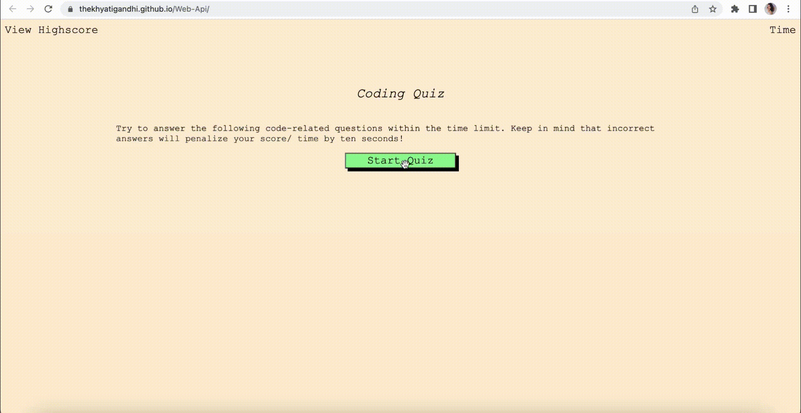

# Multiplpe Choice Quiz using Javascript and Web-Api

## Description

This is an multiple choice quiz app, created using html, css, javascript and web apis. When the user clicks on the right answer, they are taken to the next question. Every wrong answer means they will loose 10 seconds. The score is equal to the time remaining. This quiz is a time based quiz.

The link to the deployed page - https://thekhyatigandhi.github.io/Web-Api/

- [WEBSITE](#WEBSITE)
- [Usage](#usage)
- [Credits](#credits)
- [License](#license)

## WEBSITE

The following animation shows the web application's appearance and functionality:

## Usage

To use this website, read the instructions carefully and click on the start button. The first question will be displayed and the timer will start. You have 60 seconds to answer all the questions. Every wrong answer will deduct 10 seconds from your score.  
Make sure you answer all the questions correctly to secure a place in the highscore. 
When the quiz ends, you will be scored on the time remaining. 
Enter your initials in the box provided.  
If you want to restart the quiz, click on the restart quiz button  
To view the highscores click on the view highscore tab  

## Credits

https://www.w3schools.com/  
https://developer.mozilla.org/en-US/docs/Web/JavaScript  
Jose Lopez - My tutor who helped me with concept of javascript

## License

MIT License.
For more information on the license, please refer to the LICENSE in the repo
